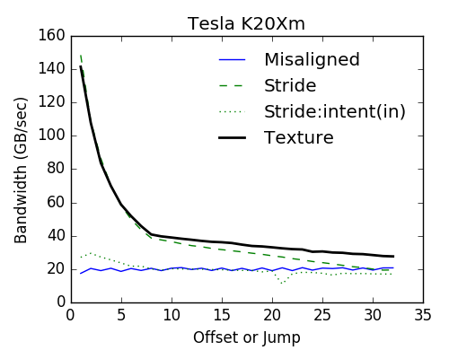

# Memory Access

## Purpose
This basic example tries to measure the bandwidth (BW) of accessding *misaligned* and *strided* data through the *global* and *texture memory*. For details, one may refer to Section 3.2 in the book: [CUDA Fortran](https://www.elsevier.com/books/cuda-fortran-for-scientists-and-engineers/ruetsch/978-0-12-416970-8).

## Fortran `intent` Statement and BW
Optionally, a decleration of function/subroutine arguments can be explicited with the `intent` statements (where the `intent` can be `in`, `out`, or `inout`). Though this is optional, in CUDA kernels, the BW gets quite affected by the `intent` statement. In more recent CUDA and PGI Fortran compilers, if an argument is declared read-only with the `intent(in)` declaration, then it will be transferred through the read-only texture cache (Gregory Ruetsch, private communication)! This is also tested here. Let me quote from him:

*This being said, soon after the book came out improvements were made where you no longer have to bind textures this way to make use of the read-only cache.  Simply declaring an argument in the kernel code as `intent(in)` will result in the compiler utilizing the texture path.* 

## Contents
The following individual modules contain CUDA kernels which assess different features in memory access
+ `krn_misaligned.cuf` for misaligned access
+ `krn_strided.cuf` for strided access with two subroutines: 
   - `stride()`: without any explicit `intent` statements, so the arrays are declared as `real :: a(:), b(:)`
   - `stride_intent()`: with explicit `intent` statements, so the arrays are declared as 
     `real, intent(in) :: a(:)`
     `real, intent(inout) :: b(:)`
     In this case, the former array `a` which is read-only goes through the texture cache.
+ `krn_texture.cuf` for texture momory access through a pointer array

## Dependencies and Compilation
This example was compiled with `PGI v.17.4` compiler and `CUDA 8.0` toolkit that ships with the compiler. To compile, just execute `make` to invoke the `Makefile`.

## Results
The `do_access.exe` provided the following graphs on two Kepler devices, K20Xm and K40c.

